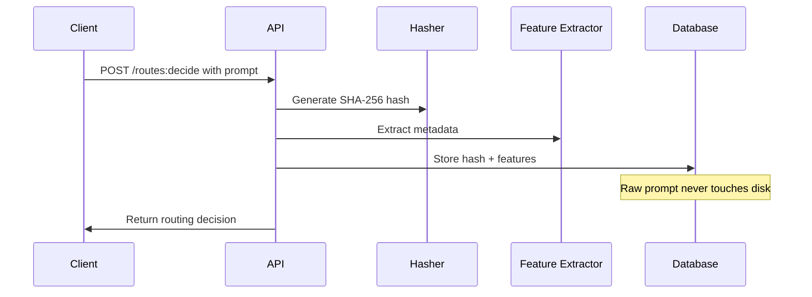

## Privacy Principles

Pathfinder is built on a foundation of privacy-first engineering. We never store your raw prompts—only anonymized hashes and extracted features.

### What We Store

✅ **What Pathfinder Stores:**
- SHA-256 hash of your prompt (irreversible)
- Prompt length (e.g., 152 characters)
- Complexity score (e.g., "medium")
- Language detection (e.g., "en")
- Domain classification (e.g., "code_generation")
- Selected model and provider
- Cost and latency estimates
- Timestamp and decision ID

❌ **What Pathfinder Never Stores:**
- Your raw prompt text
- Any personally identifiable information (PII)
- API keys or credentials
- IP addresses (beyond standard web server logs)

### How It Works



### Feature Extraction

When you send a prompt, we extract these features:

| Feature | Example | Purpose |
|---------|---------|---------|
| Length | 152 characters | Model selection (longer prompts → more capable models) |
| Complexity | "high" | Routing logic (complex prompts → reasoning models) |
| Language | "en" | Language-specific model selection |
| Domain | "code_generation" | Task-specific routing |
| Token count | ~40 tokens | Cost estimation |

**Important**: We never store the actual words, sentences, or content of your prompt.

### SHA-256 Hashing

Your prompt is hashed using SHA-256, a cryptographic one-way function:

```python
import hashlib

prompt = "Write a Python function..."
prompt_hash = hashlib.sha256(prompt.encode()).hexdigest()
# Result: "a7f5d8e3c9b2f1e..."

# The hash is stored, the prompt is discarded
```

**Properties of SHA-256:**
- **One-way**: Cannot reverse the hash to get the original prompt
- **Deterministic**: Same prompt always produces the same hash
- **Collision-resistant**: Virtually impossible for two different prompts to produce the same hash

### Tenant Isolation

All data is isolated by tenant:

- **Row-Level Security (RLS)**: PostgreSQL policies enforce tenant boundaries
- **API-Level Validation**: Every request validates tenant ID from JWT
- **Application-Level Filtering**: All queries automatically scoped to tenant

```sql
-- Example: PostgreSQL RLS policy
CREATE POLICY tenant_isolation ON routing_decisions
    USING (tenant_id = current_setting('app.tenant_id')::uuid);
```

This means:
- You can only see your own routing decisions
- No cross-tenant data leakage
- Complete organizational isolation

### Compliance

Pathfinder's privacy-first design helps you comply with:

- **GDPR**: No personal data stored without explicit consent
- **CCPA**: No sale of personal information
- **HIPAA**: Can be deployed in HIPAA-compliant environments (contact sales)
- **SOC 2**: Privacy controls aligned with SOC 2 requirements

### Audit Logging

All routing decisions are logged for audit purposes:

```json
{
  "decision_id": "550e8400-e29b-41d4-a716-446655440000",
  "tenant_id": "acme-corp",
  "prompt_hash": "a7f5d8e3c9b2f1e...",
  "selected_model": "gpt-4-turbo-preview",
  "timestamp": "2025-11-11T15:30:00Z"
}
```

You can retrieve your audit logs via:
- Dashboard at https://pathfinder.ai/dashboard
- API endpoint: `GET /audit-logs`
- Bulk export for compliance

### Data Retention

| Data Type | Retention Period | Deletion |
|-----------|------------------|----------|
| Routing decisions | 90 days (default) | Automatic |
| Prompt hashes | 90 days (default) | Automatic |
| Audit logs | 1 year (configurable) | Automatic or manual |
| Account data | Until account deletion | Manual on request |

Enterprise customers can configure custom retention policies.

### Data Location

- **US Region**: Data stored in AWS us-east-1 (Virginia)
- **EU Region**: Data stored in AWS eu-west-1 (Ireland)
- **Custom Regions**: Available for enterprise customers

You can specify your preferred region when signing up.

### Third-Party Sharing

Pathfinder **does not** share your data with:
- Model providers (OpenAI, Anthropic, Google, etc.)
- Analytics providers
- Marketing platforms
- Any third parties

The only exception: Subprocessors for infrastructure (AWS, Stripe for billing).

### Security Measures

- **Encryption at rest**: AES-256 encryption for all data
- **Encryption in transit**: TLS 1.3 for all API requests
- **API key rotation**: Automatic key rotation every 90 days
- **Access controls**: Role-based access control (RBAC)
- **Penetration testing**: Annual third-party security audits

### Questions?

If you have privacy or security questions:

- Read our [Privacy Policy](https://pathfinder.ai/privacy)
- Read our [Security Policy](https://pathfinder.ai/security)
- Contact our security team: [security@pathfinder.ai](mailto:security@pathfinder.ai)
- Request a Data Processing Agreement (DPA): [sales@pathfinder.ai](mailto:sales@pathfinder.ai)

## Next Steps

- [Multi-Tenancy](/docs/api/core-concepts/multi-tenancy)
- [Authentication](/docs/api/getting-started/authentication)
- [Model Providers](/docs/api/core-concepts/model-providers)
